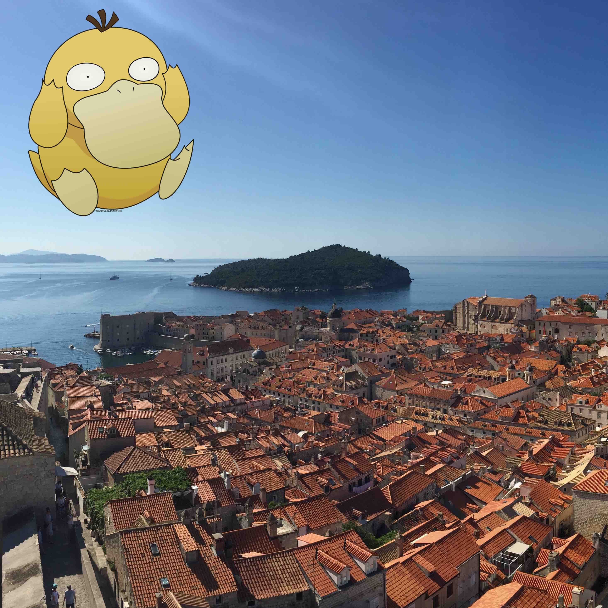
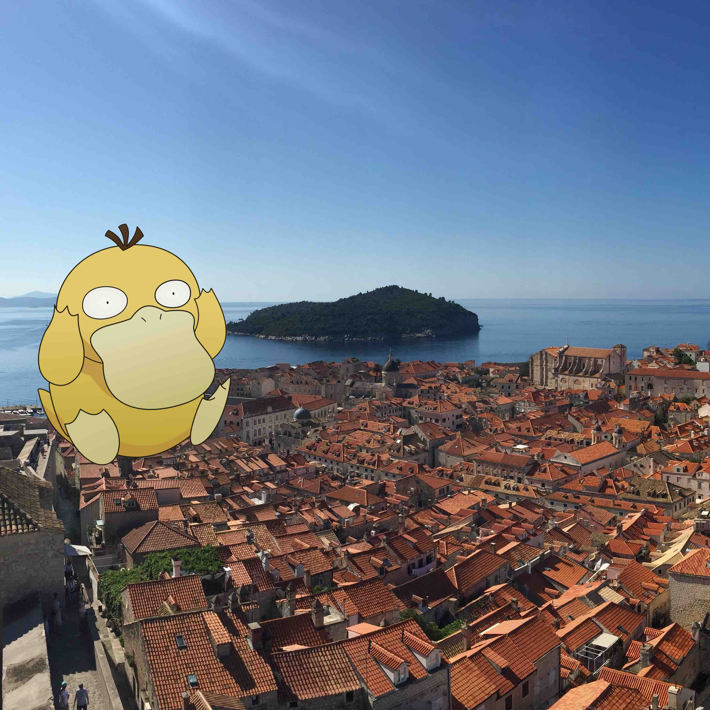
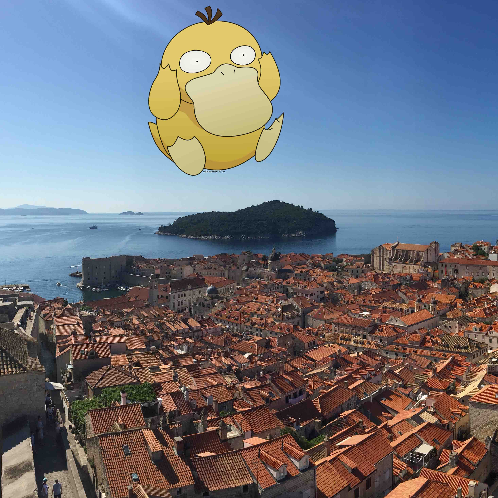
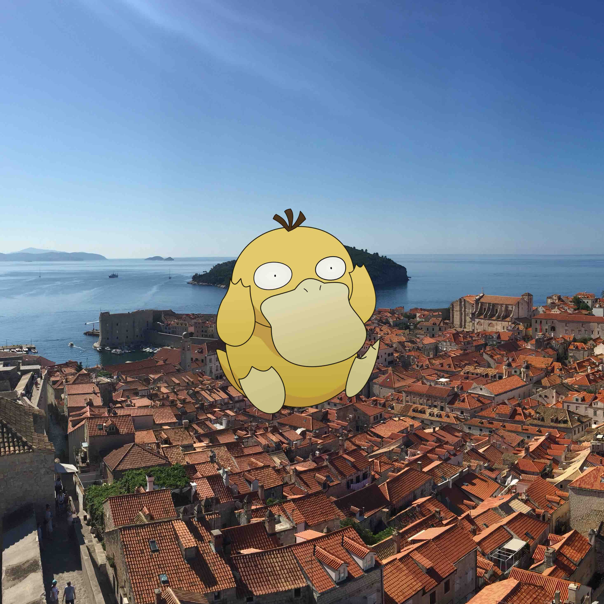
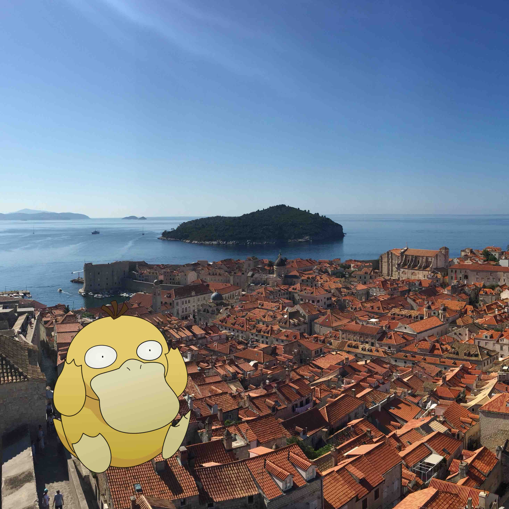
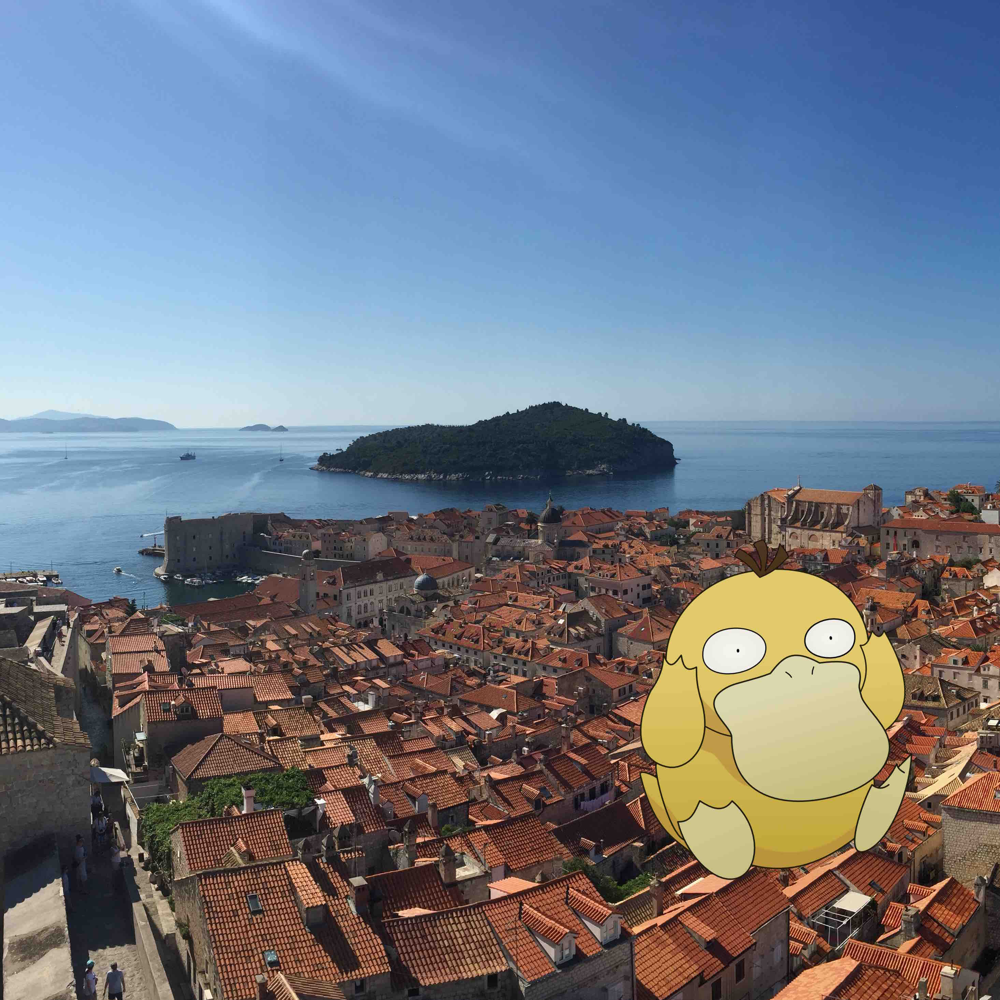
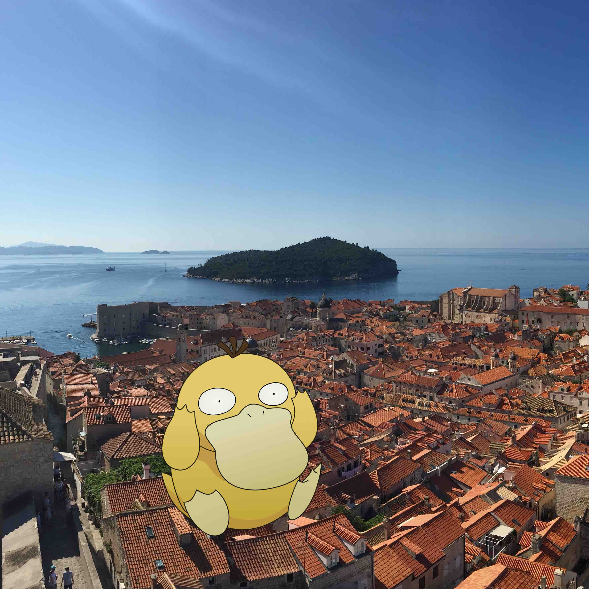
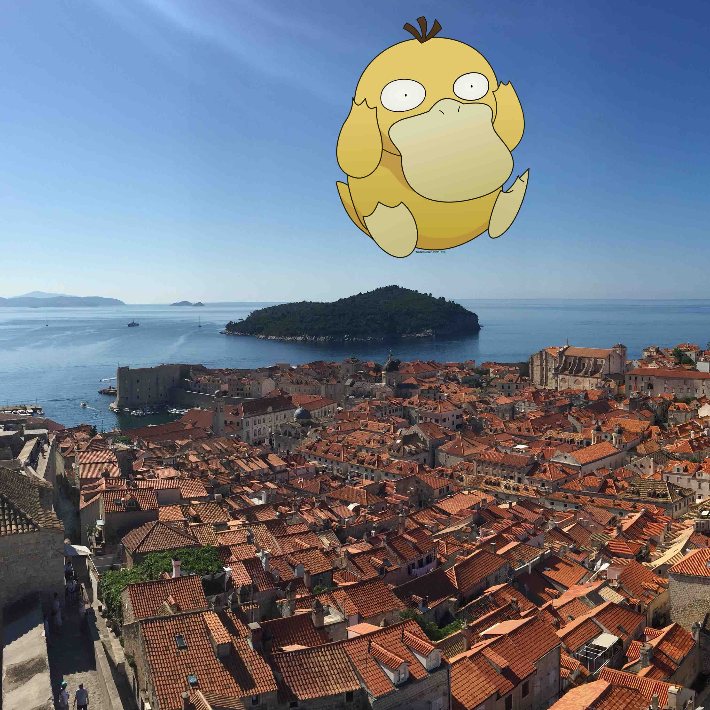
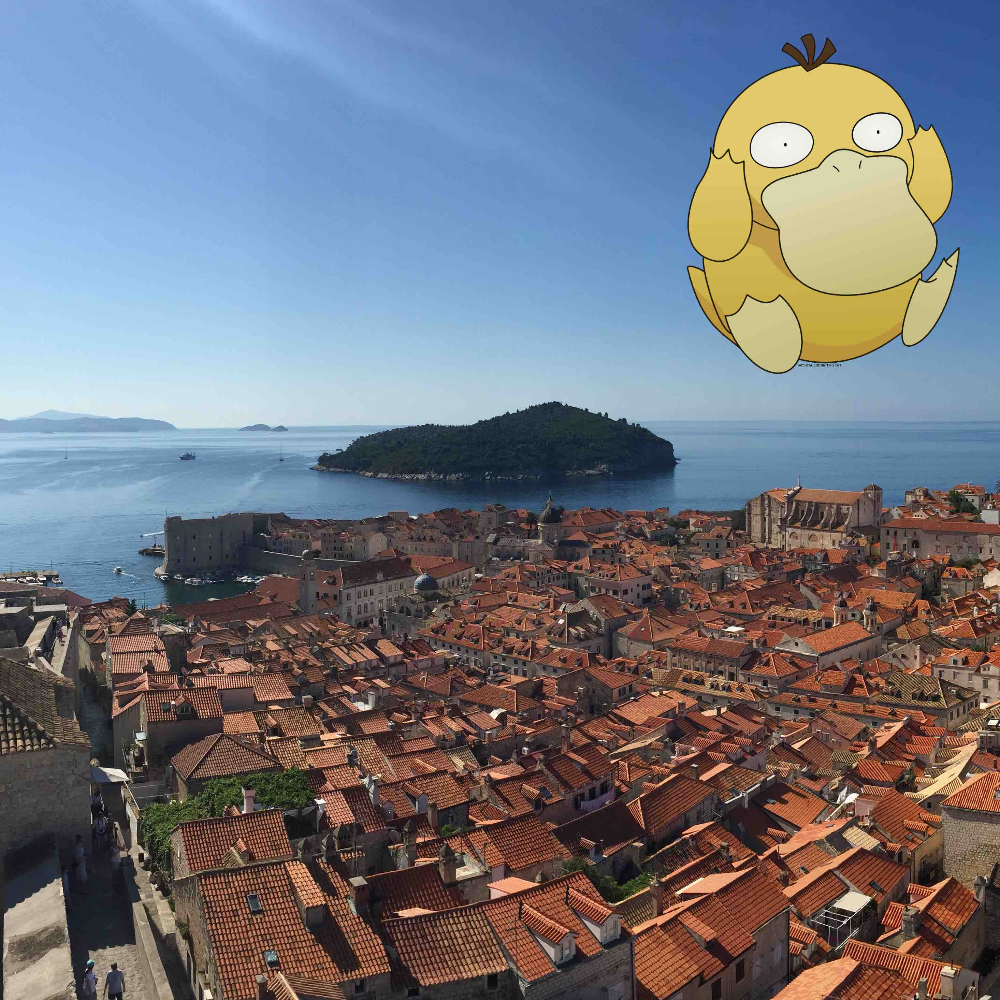

Project 2
=========

### Due Friday, October 14, 2016 - 5:00pm

The goal of this project is to implement a program that manipulates images. You will use the following features:

- One-dimensional arrays
- Two-dimensional arrays
- Methods
- Iteration

### Background

For this assignment, you will be manipulating an image.

You will need to download and use two classes that have been implemented for your: [`Pixel.java`](code/Pixel.java) and [`Picture.java`](code/Picture.java). This assignment is adapted from and these classes are implemented by Richard Wicentowski and Tia Newhall of Swarthmore.

#### Pixels

An image is effectively a 2D array of Pixels where each pixel is represented by three numbers from 0-255: the amount of red, amount of green, and amount of blue in the pixel.  (255, 255, 255) represents a white pixel (0, 0, 0) represents a black pixel.

Unlike an array, however, pixels are referenced by their (x, y) coordinates.  In the example below, the pixel marked with XXX would be referenced as (2, 3) -- so column then row rather than the array style of row then column.

```
                                   2 
            -------------------------------------------------------
            |        |        |        |       |        |        |
            -------------------------------------------------------
            |        |        |        |       |        |        |
            -------------------------------------------------------
            |        |        |        |       |        |        |
            -------------------------------------------------------
   3        |        |        |  XXX  |        |        |        |
            -------------------------------------------------------
```

The class `Picture.java` allows you to create a new image by specifying a height and width, or a filename.  If you specify the name of a file containing a jpg image, the `Picture` constructor will create a new image of the correct size.  You can retrieve the height and width of the image, as well as get and set pixels in the image.  The `get/setPixel` methods reference `Pixel` objects.  The class `Pixel.java` defines an object containing three int values: red, green, and blue.  The individual values can be accessed or changed.  Suppose a variable of type `Picture` called `image` refers to an image with height 4 and width 6 as shown above.  `image.setPixel(2, 3, new Pixel(255, 255, 255));` would set the pixel marked with the XXX above to be white.

Following is an  example that reads an image from a file, prints its dimentions, sets a single pixel to be white, and saves the resulting image to a new file:

```
Picture image = new Picture("image.jpg");
System.out.println("Image height: " + image.getHeight());
System.out.println("Image width: " + image.getWidth());
image.setPixel(2, 3, new Pixel(255, 255, 255));
image.store("newImage.jpg");
```                       

### Requirements

For this project, you will implement two classes: `ImageManipulator` and `ImageDriver`. The `ImageManipulator` will contain several methods to manipulate a set of images. 

####Photobomb Removal

The first method will remove a photobomber from a set of images. Consider the example below:

<table>
	<tr>
		<td></td>
		<td></td>
		<td></td>
	</tr>
	<tr>
		<td></td>
		<td></td>
		<td></td>
	</tr>
	<tr>
		<td></td>
		<td></td>
		<td></td>
	</tr>
	
</table>

Psyduck ruined all of my photos of Dubrovnik, but fortunately since the background image is the same across all nine photos we can use [median filtering](https://en.wikipedia.org/wiki/Median_filter) to remove him. Median filtering works by creating a new image where the red, green, and blue value for each pixel is the *median* of the values of red, green, and blue for the same pixel in the input images. If we have nine input images as in the example, the red value for the pixel at (0,0) in the new image will be the median of the red values of the nine input images.

**`removePhotobomb`**

The header of the method `removePhotobomb` will look as follows:

`public void removePhotobomb(String directory, String outputfile)`

`directory` specifies the name of the directory where all of the input images are stored, for example `images/`. You may download and unzip [images.zip](images.zip) to test your program. Make sure it is unzipped in the directory where you will run your program.

`outputfile` specifies the name of the file where the resulting image should be stored.

The suggested algorithm is as follows:

The method will first create an *array* of `Picture` objects, one for each jpg file found in the directory specified. **You may not assume that there are nine images. If there are more or fewer images your program should still behave as expected.** For full credit you must **consider the case where there are files in the directory that are not jpgs**. That is, the file names do not end with the extension .jpg.

The method will also create a new `Picture` that will store the result.

For every pixel in the input images, you will extract the red, green, and blue values from the corresponding pixel in each of nine images, sort those values, and set the value of the corresponding pixel in the result to be the *median* of the sorted values.

Finally, store the result to the output file.

You may create additional methods that implement parts of this functionality. In my solution, I created a method that loaded all of the pictures from the directory and returned an array of `Picture` objects.

####Zooming

The method `zoomMiddle` will create a new image of the *same* size that is zoomed in to the middle of the original image. If the original image is 4 inches by four inches, the new image will be four inches by four inches but will show only the 2x2 portion from the middle of the original image.

The method header will look as follows:

`public void zoomMiddle(String inputfile, String outputfile)`


####`ImageDriver`

The driver class will accept a *directory* as input at the command line. The directory will contain multiple jpg image files. Following is an example of how your program will be run:

```
java ImageDriver images/
```

The driver will perform the following algorithm:

1. Create an instance of `ImageManipulator`.
2. 


#### Photobomb Removal

#### Zoom


`ImageManipulator.java` will contin


### Submission Requirements

1. For this assignment, you will submit two files: `ImageManipulator.java` and `ImageDriver.java`

2. Make sure your code follows all requirements in the [Style Guidelines](https://github.com/CS112-F16/notes/blob/master/style.md).

3. Follow the instructions in the [SVN Guide](https://github.com/CS112-F16/notes/blob/master/svn_guide.md) for submitting your solution by the deadline.

4. Make sure you have submitted your work in an SVN directory: `https://www.cs.usfca.edu/svn/<username>/cs112/project2`
